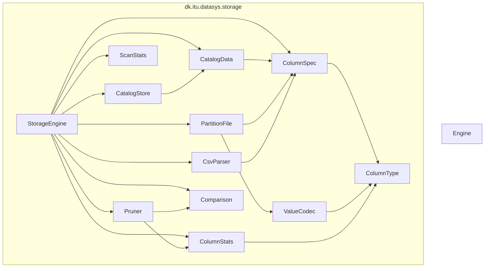

# datasys-engine-TheQueryCrew

A small SQL engine built for ITU’s *How to Build Data Systems* (Fall 2026), team **The Query Crew**. The stack is Java 25 and Maven. Right now the public storage API can create a table, `COPY` a headerless CSV into a custom columnar binary format, and `SELECT` with partition min/max pruning. Catalogs are JSON (Jackson); data files are our own binary format.

## Java files

### `dk.itu.datasys`

| File | Role |
|---|---|
| `src/main/java/dk/itu/datasys/Engine.java` | Process entrypoint (`mvn exec:java`). Currently prints the team name and sets up logging. |

### `dk.itu.datasys.storage`

| File | Role |
|---|---|
| `src/main/java/dk/itu/datasys/storage/StorageEngine.java` | Storage API: `createTable`, `copyFile`, `select`, restart from a data directory. |
| `src/main/java/dk/itu/datasys/storage/ColumnType.java` | Column types: `STRING`, `LONG`, `DOUBLE`. |
| `src/main/java/dk/itu/datasys/storage/ColumnSpec.java` | One schema column (name + type). Also stored in the catalog JSON. |
| `src/main/java/dk/itu/datasys/storage/Comparison.java` | Predicate ops: `EQUALS`, `LESS_THAN`, `GREATER_THAN`. |
| `src/main/java/dk/itu/datasys/storage/ScanStats.java` | How many partitions a `select` saw, read, and pruned. |
| `src/main/java/dk/itu/datasys/storage/CatalogData.java` | In-memory / JSON catalog: schema, `maxRowsPerPartition`, partitions and typed min/max. |
| `src/main/java/dk/itu/datasys/storage/CatalogStore.java` | Reads and writes `catalog.json` under each table directory. |
| `src/main/java/dk/itu/datasys/storage/PartitionFile.java` | Binary layout of one partition file (magic, version, offset table, column chunks). |
| `src/main/java/dk/itu/datasys/storage/ValueCodec.java` | Encode/decode one `LONG` / `DOUBLE` / `STRING` value (little-endian). |
| `src/main/java/dk/itu/datasys/storage/CsvParser.java` | Headerless positional CSV line → typed `Object[]`. |
| `src/main/java/dk/itu/datasys/storage/ColumnStats.java` | Min/max over a column and the comparator used for that type. |
| `src/main/java/dk/itu/datasys/storage/Pruner.java` | Whether a partition’s `[min, max]` can contain a match. |

### Tests

| File | Role |
|---|---|
| `src/test/java/dk/itu/datasys/EngineTest.java` | Unit test for the team-name helper. |
| `src/test/java/dk/itu/datasys/storage/StorageEngineSmokeTest.java` | End-to-end smoke test on the golden `trips.csv` data. |

## File dependencies

`Engine` does not depend on `storage` yet; wiring the demo queries into `main` is a later exercise step.
