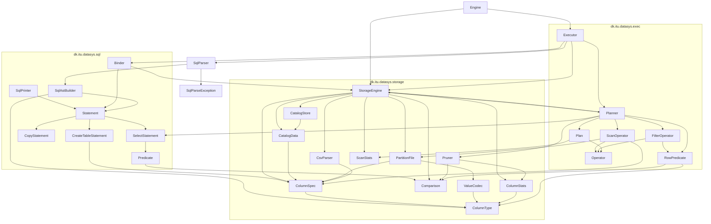

# datasys-engine-TheQueryCrew

A small SQL engine built for ITU’s *How to Build Data Systems* (Fall 2026), team **The Query Crew**. The stack is Java 25 and Maven. ANTLR 4 generates the lexer/parser from `src/main/antlr4/dk/itu/datasys/sql/Sql.g4` on `mvn compile`; generated Java lands in `target/generated-sources/antlr4` and is not committed. SQL text parses to a typed AST (`CREATE TABLE` / `COPY` / `SELECT`). A planner turns a bound `SELECT` into a Volcano pipeline (`Scan` → optional `Filter`), pruning partitions from catalog min/max before any data file opens. An executor runs `parse → bind → plan → execute` statement by statement. The storage API can create a table, `COPY` a headerless CSV into a custom columnar binary format, and `SELECT` (same week-2 signature) which now plans and drains that pipeline internally. Catalogs are JSON (Jackson); data files are our own binary format.

`mvn test` runs `*Test` unit tests (Surefire). `mvn verify` also runs `*IT` integration tests (Failsafe).

## Co-author Lines
```
Co-authored-by: Mie-Jonasson <jonasson2001@gmail.com>
Co-authored-by: juhv <juhv@itu.dk>

Co-authored-by: Cursor <cursoragent@cursor.com>
Co-authored-by: Claude Opus 5 <noreply@anthropic.com>
```

## Java files

### `dk.itu.datasys`

| File | Role |
|---|---|
| `src/main/java/dk/itu/datasys/Engine.java` | SQL front door (`mvn compile exec:java`): one statement, or `-f` script; SELECT rows as headerless CSV on stdout; data under `data/`. |
| `src/main/java/dk/itu/datasys/SqlParser.java` | Facade: SQL text → `List<Statement>`, or `SqlParseException` with line/column. |
| `src/main/java/dk/itu/datasys/SqlParseException.java` | Syntax error from the lexer/parser (1-based line, 0-based column). |

### `dk.itu.datasys.sql`

| File | Role |
|---|---|
| `src/main/antlr4/dk/itu/datasys/sql/Sql.g4` | Grammar for the Exercise 3 SQL subset. Path under `antlr4/` is the generated Java package. |
| `src/main/java/dk/itu/datasys/sql/SqlAstBuilder.java` | Visitor: ANTLR parse tree → AST records. Types literals as `String` / `Long` / `Double`. |
| `src/main/java/dk/itu/datasys/sql/SqlPrinter.java` | AST → SQL text; `parse(print(s))` yields an equal statement. |
| `src/main/java/dk/itu/datasys/sql/Statement.java` | Sealed AST root: `CreateTableStatement`, `CopyStatement`, `SelectStatement`. |
| `src/main/java/dk/itu/datasys/sql/CreateTableStatement.java` | `CREATE TABLE` (name + `ColumnSpec` list). |
| `src/main/java/dk/itu/datasys/sql/CopyStatement.java` | `COPY … FROM 'path'`. |
| `src/main/java/dk/itu/datasys/sql/SelectStatement.java` | `SELECT * FROM …` with optional `WHERE`. |
| `src/main/java/dk/itu/datasys/sql/Predicate.java` | `WHERE` column, `Comparison`, typed constant. |
| `src/main/java/dk/itu/datasys/sql/Binder.java` | Validates a statement against the catalog (`schema(...)`). |

### `dk.itu.datasys.exec`

| File | Role |
|---|---|
| `src/main/java/dk/itu/datasys/exec/Operator.java` | Volcano pipeline contract: `open()`, `next()` until null, `close()`. |
| `src/main/java/dk/itu/datasys/exec/ScanOperator.java` | Reads the partitions it is handed, in order. Sees no predicate and prunes nothing. |
| `src/main/java/dk/itu/datasys/exec/FilterOperator.java` | Passes on the rows its predicate accepts; logs `rowsIn`/`rowsOut` on close. |
| `src/main/java/dk/itu/datasys/exec/RowPredicate.java` | A `WHERE` by column position rather than name, as the pipeline sees it. |
| `src/main/java/dk/itu/datasys/exec/Plan.java` | Planned SELECT: operator root plus `ScanStats`; `drain()` pulls all rows. |
| `src/main/java/dk/itu/datasys/exec/Planner.java` | Bound SELECT → plan; prunes partitions and emits `decision=READ\|PRUNED` log lines. |
| `src/main/java/dk/itu/datasys/exec/Executor.java` | `parse → bind → plan → execute` per statement; CREATE/COPY call storage directly. |

### `dk.itu.datasys.storage`

| File | Role |
|---|---|
| `src/main/java/dk/itu/datasys/storage/StorageEngine.java` | Storage API: `createTable`, `copyFile`, `select` (plans + drains), `schema`/`catalog` for binder and planner. |
| `src/main/java/dk/itu/datasys/storage/ColumnType.java` | Column types: `STRING`, `LONG`, `DOUBLE`, and which Java value each accepts. |
| `src/main/java/dk/itu/datasys/storage/ColumnSpec.java` | One schema column (name + type). Also stored in the catalog JSON. |
| `src/main/java/dk/itu/datasys/storage/Comparison.java` | Predicate ops: `EQUALS`, `LESS_THAN`, `GREATER_THAN`, and the row test `matches(value, constant, type)`. |
| `src/main/java/dk/itu/datasys/storage/ScanStats.java` | How many partitions a `select` saw, read, and pruned. |
| `src/main/java/dk/itu/datasys/storage/CatalogData.java` | In-memory / JSON catalog: schema, `maxRowsPerPartition`, partitions and typed min/max. |
| `src/main/java/dk/itu/datasys/storage/CatalogStore.java` | Reads and writes `catalog.json` under each table directory. |
| `src/main/java/dk/itu/datasys/storage/PartitionFile.java` | Binary layout of one partition file (magic, version, offset table, column chunks). Only `readAllColumns` is open outside the package; writing stays with `copyFile`, so every file has a catalog entry. |
| `src/main/java/dk/itu/datasys/storage/ValueCodec.java` | Encode/decode one `LONG` / `DOUBLE` / `STRING` value (little-endian). |
| `src/main/java/dk/itu/datasys/storage/CsvParser.java` | Headerless positional CSV line → typed `Object[]`. |
| `src/main/java/dk/itu/datasys/storage/ColumnStats.java` | Min/max over a column and the comparator used for that type. |
| `src/main/java/dk/itu/datasys/storage/Pruner.java` | Whether a partition’s `[min, max]` can contain a match. |

### Tests

| File | Role |
|---|---|
| `src/test/java/dk/itu/datasys/EngineTest.java` | Unit test for the team-name helper. |
| `src/test/java/dk/itu/datasys/EngineFrontDoorIT.java` | Front door: script → headerless CSV on stdout; failing script → stderr only. |
| `src/test/java/dk/itu/datasys/SqlParserTest.java` | Parser unit tests: statement shapes, literals, case, malformed line/col, comments. |
| `src/test/java/dk/itu/datasys/sql/SqlPrinterTest.java` | Pretty-printer round-trip over every statement shape. |
| `src/test/java/dk/itu/datasys/storage/ValueCodecTest.java` | Encode/decode round trip per column type. |
| `src/test/java/dk/itu/datasys/storage/ColumnStatsTest.java` | Min/max over a column. |
| `src/test/java/dk/itu/datasys/storage/PrunerTest.java` | Partition prune-or-read decisions. |
| `src/test/java/dk/itu/datasys/storage/CsvParserTest.java` | Headerless CSV line parsing. |
| `src/test/java/dk/itu/datasys/storage/StorageEngineSmokeTest.java` | End-to-end smoke test on the golden `trips.csv` data. |
| `src/test/java/dk/itu/datasys/sql/BinderIT.java` | Binder + `StorageEngine` on `@TempDir` (exercise 3.7). |
| `src/test/java/dk/itu/datasys/storage/StorageEngineIT.java` | Required Exercise 2 integration tests against `StorageEngine`. |
| `src/test/java/dk/itu/datasys/storage/ColumnTypeTest.java` | Which Java value each column type accepts. |
| `src/test/java/dk/itu/datasys/exec/FilterOperatorTest.java` | Filter over a stub child, including lexicographic `STRING` order and exhaustion. |
| `src/test/java/dk/itu/datasys/exec/ScanOperatorTest.java` | Scan over real partition files, including the fully pruned empty-partition case. |
| `src/test/java/dk/itu/datasys/exec/PlannerTest.java` | Planner shapes (Filter/Scan) and pruning `ScanStats` on sorted golden data. |
| `src/test/java/dk/itu/datasys/exec/TestListOperator.java` | Test helper: a stub child operator serving rows from a list. |
| `src/test/java/dk/itu/datasys/storage/TestPartitions.java` | Test helper: writes a partition file for tests outside the storage package. |

## File dependencies



`mvn compile exec:java` is the SQL front door: one statement, or `-f` a `.sql` file; SELECT rows as headerless CSV on stdout; storage under `data/`.
