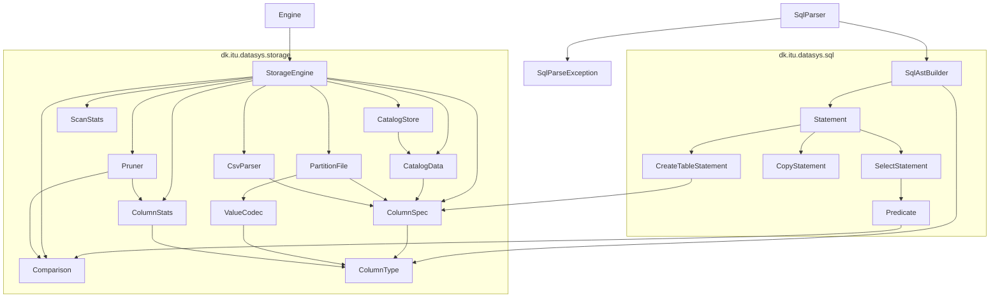

# datasys-engine-TheQueryCrew

A small SQL engine built for ITU’s *How to Build Data Systems* (Fall 2026), team **The Query Crew**. The stack is Java 25 and Maven. ANTLR 4 generates the lexer/parser from `src/main/antlr4/dk/itu/datasys/sql/Sql.g4` on `mvn compile`; generated Java lands in `target/generated-sources/antlr4` and is not committed. SQL text parses to a typed AST (`CREATE TABLE` / `COPY` / `SELECT`); nothing executes from SQL yet. The storage API can create a table, `COPY` a headerless CSV into a custom columnar binary format, and `SELECT` with partition min/max pruning. Catalogs are JSON (Jackson); data files are our own binary format.

`mvn test` runs `*Test` unit tests (Surefire). `mvn verify` also runs `*IT` integration tests (Failsafe).

## Java files

### `dk.itu.datasys`

| File | Role |
|---|---|
| `src/main/java/dk/itu/datasys/Engine.java` | Process entrypoint (`mvn compile exec:java`). Runs the three golden trips queries. |
| `src/main/java/dk/itu/datasys/SqlParser.java` | Facade: SQL text → `List<Statement>`, or `SqlParseException` with line/column. |
| `src/main/java/dk/itu/datasys/SqlParseException.java` | Syntax error from the lexer/parser (1-based line, 0-based column). |

### `dk.itu.datasys.sql`

| File | Role |
|---|---|
| `src/main/antlr4/dk/itu/datasys/sql/Sql.g4` | Grammar for the Exercise 3 SQL subset. Path under `antlr4/` is the generated Java package. |
| `src/main/java/dk/itu/datasys/sql/SqlAstBuilder.java` | Visitor: ANTLR parse tree → AST records. Types literals as `String` / `Long` / `Double`. |
| `src/main/java/dk/itu/datasys/sql/Statement.java` | Sealed AST root: `CreateTableStatement`, `CopyStatement`, `SelectStatement`. |
| `src/main/java/dk/itu/datasys/sql/CreateTableStatement.java` | `CREATE TABLE` (name + `ColumnSpec` list). |
| `src/main/java/dk/itu/datasys/sql/CopyStatement.java` | `COPY … FROM 'path'`. |
| `src/main/java/dk/itu/datasys/sql/SelectStatement.java` | `SELECT * FROM …` with optional `WHERE`. |
| `src/main/java/dk/itu/datasys/sql/Predicate.java` | `WHERE` column, `Comparison`, typed constant. |

### `dk.itu.datasys.storage`

| File | Role |
|---|---|
| `src/main/java/dk/itu/datasys/storage/StorageEngine.java` | Storage API: `createTable`, `copyFile`, `select`, restart from a data directory. |
| `src/main/java/dk/itu/datasys/storage/ColumnType.java` | Column types: `STRING`, `LONG`, `DOUBLE`. |
| `src/main/java/dk/itu/datasys/storage/ColumnSpec.java` | One schema column (name + type). Also stored in the catalog JSON. |
| `src/main/java/dk/itu/datasys/storage/Comparison.java` | Predicate ops: `EQUALS`, `LESS_THAN`, `GREATER_THAN`. |
| `src/main/java/dk/itu/datasys/storage/ScanStats.java` | How many partitions a `select` saw, read, and pruned. |
| `src/main/java/dk/itu/datasys/storage/CatalogData.java` | In-memory / JSON catalog: schema, `maxRowsPerPartition`, partitions and typed min/max. |
| `src/main/java/dk/itu/datasys/storage/CatalogStore.java` | Reads and writes `catalog.json` under each table directory. |
| `src/main/java/dk/itu/datasys/storage/PartitionFile.java` | Binary layout of one partition file (magic, version, offset table, column chunks). |
| `src/main/java/dk/itu/datasys/storage/ValueCodec.java` | Encode/decode one `LONG` / `DOUBLE` / `STRING` value (little-endian). |
| `src/main/java/dk/itu/datasys/storage/CsvParser.java` | Headerless positional CSV line → typed `Object[]`. |
| `src/main/java/dk/itu/datasys/storage/ColumnStats.java` | Min/max over a column and the comparator used for that type. |
| `src/main/java/dk/itu/datasys/storage/Pruner.java` | Whether a partition’s `[min, max]` can contain a match. |

### Tests

| File | Role |
|---|---|
| `src/test/java/dk/itu/datasys/EngineTest.java` | Unit test for the team-name helper. |
| `src/test/java/dk/itu/datasys/storage/ValueCodecTest.java` | Encode/decode round trip per column type. |
| `src/test/java/dk/itu/datasys/storage/ColumnStatsTest.java` | Min/max over a column. |
| `src/test/java/dk/itu/datasys/storage/PrunerTest.java` | Partition prune-or-read decisions. |
| `src/test/java/dk/itu/datasys/storage/CsvParserTest.java` | Headerless CSV line parsing. |
| `src/test/java/dk/itu/datasys/storage/StorageEngineSmokeTest.java` | End-to-end smoke test on the golden `trips.csv` data. |
| `src/test/java/dk/itu/datasys/storage/StorageEngineIT.java` | Required Exercise 2 integration tests against `StorageEngine`. |

## File dependencies

`mvn compile exec:java` loads `src/test/resources/trips.csv` and prints the three golden queries.
