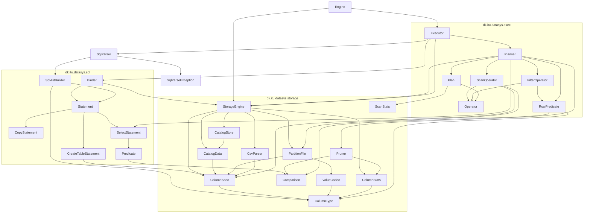
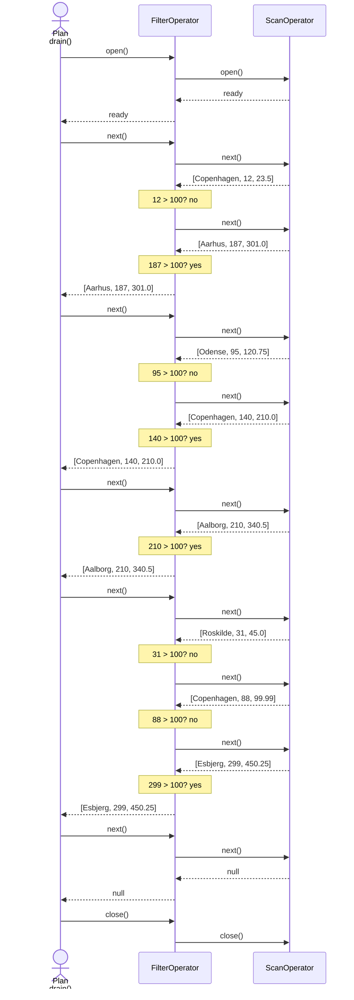

# datasys-engine-TheQueryCrew

A small SQL engine built for ITU’s *How to Build Data Systems* (Fall 2026), team **The Query Crew**. The stack is Java 25 and Maven. ANTLR 4 generates the lexer/parser from `src/main/antlr4/dk/itu/datasys/sql/Sql.g4` on `mvn compile`; generated Java lands in `target/generated-sources/antlr4` and is not committed. SQL text parses to a typed AST (`CREATE TABLE` / `COPY` / `SELECT`). A planner turns a bound `SELECT` into a Volcano pipeline (`Scan` → optional `Filter`), pruning partitions from catalog min/max before any data file opens. An executor runs `parse → bind → plan → execute` statement by statement. The storage API creates a table and `COPY`s a headerless CSV into a custom columnar binary format; `SELECT` is planned and drained by `Executor`. Catalogs are JSON (Jackson); data files are our own binary format.

`mvn test` runs `*Test` unit tests (Surefire). `mvn verify` also runs `*IT` integration tests (Failsafe).

## Co-author Lines
```
Co-authored-by: Mie-Jonasson <jonasson2001@gmail.com>
Co-authored-by: juhv <juhv@itu.dk>

Co-authored-by: Cursor <cursoragent@cursor.com>
Co-authored-by: Claude Opus 5 <noreply@anthropic.com>
```

## Java files

### `dk.itu.datasys`

| File | Role |
|---|---|
| `src/main/java/dk/itu/datasys/Engine.java` | SQL front door (`./engine`): `-c` for a statement or script, or `-f` a file; SELECT rows as headerless CSV on stdout; data under `data/`. |
| `src/main/java/dk/itu/datasys/SqlParser.java` | Facade: SQL text → `List<Statement>`, or `SqlParseException` with line/column. |
| `src/main/java/dk/itu/datasys/SqlParseException.java` | Syntax error from the lexer/parser (1-based line, 0-based column). |

### `dk.itu.datasys.sql`

| File | Role |
|---|---|
| `src/main/antlr4/dk/itu/datasys/sql/Sql.g4` | Grammar for the Exercise 3 SQL subset. Path under `antlr4/` is the generated Java package. |
| `src/main/java/dk/itu/datasys/sql/SqlAstBuilder.java` | Visitor: ANTLR parse tree → AST records. Types literals as `String` / `Long` / `Double`. |
| `src/main/java/dk/itu/datasys/sql/Statement.java` | Sealed AST root: `CreateTableStatement`, `CopyStatement`, `SelectStatement`. |
| `src/main/java/dk/itu/datasys/sql/CreateTableStatement.java` | `CREATE TABLE` (name + `ColumnSpec` list). |
| `src/main/java/dk/itu/datasys/sql/CopyStatement.java` | `COPY … FROM 'path'`. |
| `src/main/java/dk/itu/datasys/sql/SelectStatement.java` | `SELECT * FROM …` with optional `WHERE`. |
| `src/main/java/dk/itu/datasys/sql/Predicate.java` | `WHERE` column, `Comparison`, typed constant. |
| `src/main/java/dk/itu/datasys/sql/Binder.java` | Validates a statement against the catalog (`schema(...)`). |

### `dk.itu.datasys.exec`

| File | Role |
|---|---|
| `src/main/java/dk/itu/datasys/exec/Operator.java` | Volcano pipeline contract: `open()`, `next()` until null, `close()`. |
| `src/main/java/dk/itu/datasys/exec/ScanOperator.java` | Reads the partitions it is handed, in order. Sees no predicate and prunes nothing. |
| `src/main/java/dk/itu/datasys/exec/FilterOperator.java` | Passes on the rows its predicate accepts; logs `rowsIn`/`rowsOut` on close. |
| `src/main/java/dk/itu/datasys/exec/RowPredicate.java` | A `WHERE` by column position rather than name, as the pipeline sees it. |
| `src/main/java/dk/itu/datasys/exec/Plan.java` | Planned SELECT: operator root plus `ScanStats`; `drain()` pulls all rows. |
| `src/main/java/dk/itu/datasys/exec/Planner.java` | Bound SELECT → plan; prunes partitions and emits `decision=READ\|PRUNED` log lines. |
| `src/main/java/dk/itu/datasys/exec/Executor.java` | `parse → bind → plan → execute` per statement; CREATE/COPY call storage directly. Counts `statementNumber` into the MDC from 1, back to 0 when the script ends. |

### `dk.itu.datasys.storage`

| File | Role |
|---|---|
| `src/main/java/dk/itu/datasys/storage/StorageEngine.java` | Storage API: `createTable`, `copyFile`, `schema`/`catalog` for binder and planner. |
| `src/main/java/dk/itu/datasys/storage/ColumnType.java` | Column types: `STRING`, `LONG`, `DOUBLE`, and which Java value each accepts. |
| `src/main/java/dk/itu/datasys/storage/ColumnSpec.java` | One schema column (name + type). Also stored in the catalog JSON. |
| `src/main/java/dk/itu/datasys/storage/Comparison.java` | Predicate ops: `EQUALS`, `LESS_THAN`, `GREATER_THAN`, and the row test `matches(value, constant, type)`. |
| `src/main/java/dk/itu/datasys/storage/ScanStats.java` | How many partitions a planned SELECT saw, read, and pruned. |
| `src/main/java/dk/itu/datasys/storage/CatalogData.java` | In-memory / JSON catalog: schema, `maxRowsPerPartition`, partitions and typed min/max. |
| `src/main/java/dk/itu/datasys/storage/CatalogStore.java` | Reads and writes `catalog.json` under each table directory. |
| `src/main/java/dk/itu/datasys/storage/PartitionFile.java` | Binary layout of one partition file (magic, version, offset table, column chunks). Only `readAllColumns` is open outside the package; writing stays with `copyFile`, so every file has a catalog entry. |
| `src/main/java/dk/itu/datasys/storage/ValueCodec.java` | Encode/decode one `LONG` / `DOUBLE` / `STRING` value (little-endian). |
| `src/main/java/dk/itu/datasys/storage/CsvParser.java` | Headerless positional CSV line → typed `Object[]`. |
| `src/main/java/dk/itu/datasys/storage/ColumnStats.java` | Min/max over a column and the comparator used for that type. |
| `src/main/java/dk/itu/datasys/storage/Pruner.java` | Whether a partition’s `[min, max]` can contain a match. |

### Tests

| File | Role |
|---|---|
| `src/test/java/dk/itu/datasys/EngineTest.java` | Unit test for the team-name helper. |
| `src/test/java/dk/itu/datasys/EngineFrontDoorIT.java` | Front door: script → headerless CSV on stdout; failing script → stderr only. |
| `src/test/java/dk/itu/datasys/SqlParserTest.java` | Parser unit tests: statement shapes, literals, case, malformed line/col, comments. |
| `src/test/java/dk/itu/datasys/storage/ValueCodecTest.java` | Encode/decode round trip per column type. |
| `src/test/java/dk/itu/datasys/storage/ColumnStatsTest.java` | Min/max over a column. |
| `src/test/java/dk/itu/datasys/storage/PrunerTest.java` | Partition prune-or-read decisions. |
| `src/test/java/dk/itu/datasys/storage/CsvParserTest.java` | Headerless CSV line parsing. |
| `src/test/java/dk/itu/datasys/storage/StorageEngineSmokeTest.java` | End-to-end smoke test on the golden `trips.csv` data. |
| `src/test/java/dk/itu/datasys/sql/BinderIT.java` | Binder + `StorageEngine` on `@TempDir` (exercise 3.7). |
| `src/test/java/dk/itu/datasys/storage/StorageEngineIT.java` | Storage + SQL SELECT integration tests (create/copy/persist/prune). |
| `src/test/java/dk/itu/datasys/storage/ColumnTypeTest.java` | Which Java value each column type accepts. |
| `src/test/java/dk/itu/datasys/exec/FilterOperatorTest.java` | Filter over a stub child, including lexicographic `STRING` order and exhaustion. |
| `src/test/java/dk/itu/datasys/exec/ScanOperatorTest.java` | Scan over real partition files, including the fully pruned empty-partition case. |
| `src/test/java/dk/itu/datasys/exec/PlannerTest.java` | Planner shapes (Filter/Scan) and pruning `ScanStats` on sorted golden data. |
| `src/test/java/dk/itu/datasys/exec/TestListOperator.java` | Test helper: a stub child operator serving rows from a list. |
| `src/test/java/dk/itu/datasys/storage/TestPartitions.java` | Test helper: writes a partition file for tests outside the storage package. |

## File dependencies


```mermaid
flowchart TD
  Engine
  SqlParser
  SqlParseException
  subgraph sqlPkg ["dk.itu.datasys.sql"]
    SqlAstBuilder
    Binder
    Statement
    CreateTableStatement
    CopyStatement
    SelectStatement
    Predicate
  end
  subgraph execPkg ["dk.itu.datasys.exec"]
    Operator
    ScanOperator
    FilterOperator
    RowPredicate
    Plan
    Planner
    Executor
  end
  subgraph storagePkg ["dk.itu.datasys.storage"]
    StorageEngine
    CatalogStore
    CatalogData
    PartitionFile
    CsvParser
    Pruner
    ColumnStats
    ColumnSpec
    Comparison
    ScanStats
    ValueCodec
    ColumnType
  end
  Engine --> Executor
  Engine --> StorageEngine
  SqlParser --> SqlAstBuilder
  Binder --> Statement
  Binder --> StorageEngine
  SqlParser --> SqlParseException
  SqlAstBuilder --> Statement
  Statement --> CreateTableStatement
  Statement --> CopyStatement
  Statement --> SelectStatement
  CreateTableStatement --> ColumnSpec
  SelectStatement --> Predicate
  Predicate --> Comparison
  SqlAstBuilder --> ColumnType
  StorageEngine --> CatalogStore
  StorageEngine --> CatalogData
  StorageEngine --> PartitionFile
  StorageEngine --> CsvParser
  StorageEngine --> ColumnStats
  StorageEngine --> ColumnSpec
  CatalogStore --> CatalogData
  CatalogData --> ColumnSpec
  PartitionFile --> ValueCodec
  PartitionFile --> ColumnSpec
  CsvParser --> ColumnSpec
  Pruner --> ColumnStats
  Pruner --> Comparison
  ColumnSpec --> ColumnType
  ValueCodec --> ColumnType
  ColumnStats --> ColumnType
  ScanOperator --> Operator
  FilterOperator --> Operator
  FilterOperator --> RowPredicate
  ScanOperator --> PartitionFile
  ScanOperator --> ColumnSpec
  RowPredicate --> Comparison
  RowPredicate --> ColumnType
  Plan --> Operator
  Plan --> ScanStats
  Planner --> Plan
  Planner --> ScanOperator
  Planner --> FilterOperator
  Planner --> RowPredicate
  Planner --> Pruner
  Planner --> StorageEngine
  Planner --> SelectStatement
  Executor --> SqlParser
  Executor --> Binder
  Executor --> Planner
  Executor --> StorageEngine
```

`mvn package` writes `target/engine.jar`. `./engine` is the SQL front door: `-c` a statement or script, or `-f` a `.sql` file; SELECT rows as headerless CSV on stdout; storage under `data/`.

## Tracing a Statement through the Engine
In order to fully understand to code base, it is useful to look at it from the perspective of a single SELECT statement with a predicate, and investigate what happens throughout class instances and function calls.

Let's consider the statement `SELECT * FROM trips WHERE distance > 100;` (which is often used in testing), considering an instance of the engine where the trips table has already been created through:

```sql
CREATE TABLE trips (city STRING, distance LONG, price DOUBLE);
COPY trips FROM 'sources/trips.csv';
```

We consider in particular a command-line call `./engine -c "SELECT * FROM trips WHERE distance > 100;"`. This outputs the logs:
```
11:26:08.857 DEBUG Engine - engine started
11:26:08.970 DEBUG SqlParser - statements=1 durationMs=17
11:26:08.972 DEBUG StorageEngine - op=schema table=trips columns=3
11:26:08.973 DEBUG Planner - op=select table=trips column=distance comparison=GREATER_THAN const=100 partition=0 min=12 max=299 decision=READ
11:26:08.975 DEBUG FilterOperator - op=filter rowsIn=8 rowsOut=4
11:26:08.975 DEBUG ScanOperator - op=scan table=trips partitions=1 rowsOut=8
Aarhus,187,301.0
Copenhagen,140,210.0
Aalborg,210,340.5
Esbjerg,299,450.25
11:26:08.975 DEBUG Engine - engine stopped
```

The following intermediate states in the code happen between calling from the command line and producing the csv output:
1. In `Engine.java` the function is called `run(args = ["-c", "SELECT * FROM trips WHERE distance > 100;"], dataDir = Path.of("data"), out = System.out, err = System.err)`
2. In `Engine.java` the variable `sql` is assigned through `resolveSql(args = ["-c", "SELECT * FROM trips WHERE distance > 100;"])` to equal `sql = "SELECT * FROM trips WHERE distance > 100;"`
3. In `Engine.java` the `Executor(engine)` is called to `executor.execute("SELECT * FROM trips WHERE distance > 100;")`
    - In `Executor.java` the `Parser()` is invoked assigning `statements = parser.parse("SELECT * FROM trips WHERE distance > 100;")`. The Parser returns a single-statement-list of: `SelectStatement(tableName = "trips", where = Predicate(columnName = "distance", comparison = Comparison.GREATER_THAN, constant = 100L))`
    - In `Executor.java` the overload `execute(Statement statements[0])` is called. This call initially binds the statement through `binder.bind(statements[0])`, yielding no errors for the specified engine. The binder checks table existence, column existence and data type of the constant against the catalog.
    - In `Executor.java` the planner is called assigning `plan = planner.plan(statements[0])`, yielding the assignment value `Plan(FilterOperator(ScanOperator(tableName = "trips", columns = [ColumnSpec("city", STRING), ColumnSpec("distance", LONG), ColumnSpec("price", DOUBLE)], partitionFiles = [Path.of("data/trips/partition-0.bin")]), RowPredicate(columnIndex = 1, comparison = Comparison.GREATER_THAN, constant = 100L, columnType = LONG)), ScanStats(partitionsTotal = 1, partitionsRead = 1, partitionsPruned = 0))`
    - Then the engine records the scanStats (i.e. pruned partitions) in the log
    -  In `Executor.java` the plan is drained (i.e. executed / run) and keeps track of returned rows. See below description of the communication or the example back-and-forth of the 8 rows in trips.csv below this description.
        - The `Plan` object, when drained, invokes the root Operator (in our case the `FilterOperator`) by calling `open()` on it.
        - The `FilterOperator` object, when opened, will call `open()` on its child, which in our case is the `ScanOperator`. The `ScanOperator` is a leaf / final operator and invokes no further nodes.
        - the `Plan` object then iteratively calls `next()` on the root Operator (in our case the `FilterOperator`) until receiving the value `null` in return.
        - The `FilterOperator` object, when called to `next()`, will call `next()` on its child `ScanOperator` and evaluate the `RowPredicate`. if it holds, it will return to its caller (the `Plan` object), otherwise it will repeat. If the child returns `null`, it will also return `null` to its parent.
        - The `ScanOperator` object, when called to `next()`, reads the next partition (from the list of partitions on initialization) if no more data is in the loaded partition and then simply return the next row of the partition. If no more partitions can be read, returns `null`.
        - At last, everything is closed nestedly
4. In `Engine.java` the returned row values from execution is written to `out` in csv format


```mermaid
sequenceDiagram
    actor Plan as Plan<br/>drain()
    participant Filter as FilterOperator
    participant Scan as ScanOperator

    Plan->>Filter: open()
    Filter->>Scan: open()
    Scan-->>Filter: ready
    Filter-->>Plan: ready

    Plan->>Filter: next()
    Filter->>Scan: next()
    Scan-->>Filter: [Copenhagen, 12, 23.5]
    Note over Filter: 12 > 100? no
    Filter->>Scan: next()
    Scan-->>Filter: [Aarhus, 187, 301.0]
    Note over Filter: 187 > 100? yes
    Filter-->>Plan: [Aarhus, 187, 301.0]

    Plan->>Filter: next()
    Filter->>Scan: next()
    Scan-->>Filter: [Odense, 95, 120.75]
    Note over Filter: 95 > 100? no
    Filter->>Scan: next()
    Scan-->>Filter: [Copenhagen, 140, 210.0]
    Note over Filter: 140 > 100? yes
    Filter-->>Plan: [Copenhagen, 140, 210.0]

    Plan->>Filter: next()
    Filter->>Scan: next()
    Scan-->>Filter: [Aalborg, 210, 340.5]
    Note over Filter: 210 > 100? yes
    Filter-->>Plan: [Aalborg, 210, 340.5]

    Plan->>Filter: next()
    Filter->>Scan: next()
    Scan-->>Filter: [Roskilde, 31, 45.0]
    Note over Filter: 31 > 100? no
    Filter->>Scan: next()
    Scan-->>Filter: [Copenhagen, 88, 99.99]
    Note over Filter: 88 > 100? no
    Filter->>Scan: next()
    Scan-->>Filter: [Esbjerg, 299, 450.25]
    Note over Filter: 299 > 100? yes
    Filter-->>Plan: [Esbjerg, 299, 450.25]

    Plan->>Filter: next()
    Filter->>Scan: next()
    Scan-->>Filter: null
    Filter-->>Plan: null

    Plan->>Filter: close()
    Filter->>Scan: close()
```