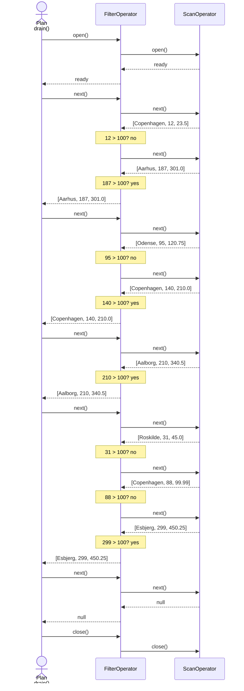

# System analysis

Two ways of looking at the engine from the outside. The first follows one statement through every
class it touches. The second has the engine read its own log, which is where the behaviour the
first one describes shows up as data.

## Tracing a Statement through the Engine
In order to fully understand to code base, it is useful to look at it from the perspective of a single SELECT statement with a predicate, and investigate what happens throughout class instances and function calls.

Let's consider the statement `SELECT * FROM trips WHERE distance > 100;` (which is often used in testing), considering an instance of the engine where the trips table has already been created through:

```sql
CREATE TABLE trips (city STRING, distance LONG, price DOUBLE);
COPY trips FROM 'examples/trips.csv';
```

We consider in particular a command-line call `./engine -c "SELECT * FROM trips WHERE distance > 100;"`. This outputs the logs:
```
11:26:08.857 DEBUG Engine - engine started
11:26:08.970 DEBUG SqlParser - statements=1 durationMs=17
11:26:08.972 DEBUG StorageEngine - op=schema table=trips columns=3
11:26:08.973 DEBUG Planner - op=select table=trips column=distance comparison=GREATER_THAN const=100 partition=0 min=12 max=299 decision=READ
11:26:08.975 DEBUG FilterOperator - op=filter rowsIn=8 rowsOut=4
11:26:08.975 DEBUG ScanOperator - op=scan table=trips partitions=1 rowsOut=8
Aarhus,187,301.0
Copenhagen,140,210.0
Aalborg,210,340.5
Esbjerg,299,450.25
11:26:08.975 DEBUG Engine - engine stopped
```

The following intermediate states in the code happen between calling from the command line and producing the csv output:
1. In `Engine.java` the function is called `run(args = ["-c", "SELECT * FROM trips WHERE distance > 100;"], dataDir = Path.of("data"), out = System.out, err = System.err)`
2. In `Engine.java` the variable `sql` is assigned through `resolveSql(args = ["-c", "SELECT * FROM trips WHERE distance > 100;"])` to equal `sql = "SELECT * FROM trips WHERE distance > 100;"`
3. In `Engine.java` the `Executor(engine)` is called to `executor.execute("SELECT * FROM trips WHERE distance > 100;")`
    - In `Executor.java` the `Parser()` is invoked assigning `statements = parser.parse("SELECT * FROM trips WHERE distance > 100;")`. The Parser returns a single-statement-list of: `SelectStatement(tableName = "trips", where = Predicate(columnName = "distance", comparison = Comparison.GREATER_THAN, constant = 100L))`
    - In `Executor.java` the overload `execute(Statement statements[0])` is called. This call initially binds the statement through `binder.bind(statements[0])`, yielding no errors for the specified engine. The binder checks table existence, column existence and data type of the constant against the catalog.
    - In `Executor.java` the planner is called assigning `plan = planner.plan(statements[0])`, yielding the assignment value `Plan(FilterOperator(ScanOperator(tableName = "trips", columns = [ColumnSpec("city", STRING), ColumnSpec("distance", LONG), ColumnSpec("price", DOUBLE)], partitionFiles = [Path.of("data/trips/partition-0.bin")]), RowPredicate(columnIndex = 1, comparison = Comparison.GREATER_THAN, constant = 100L, columnType = LONG)), ScanStats(partitionsTotal = 1, partitionsRead = 1, partitionsPruned = 0))`
    - Then the engine records the scanStats (i.e. pruned partitions) in the log
    -  In `Executor.java` the plan is drained (i.e. executed / run) and keeps track of returned rows. See below description of the communication or the example back-and-forth of the 8 rows in trips.csv below this description.
        - The `Plan` object, when drained, invokes the root Operator (in our case the `FilterOperator`) by calling `open()` on it.
        - The `FilterOperator` object, when opened, will call `open()` on its child, which in our case is the `ScanOperator`. The `ScanOperator` is a leaf / final operator and invokes no further nodes.
        - the `Plan` object then iteratively calls `next()` on the root Operator (in our case the `FilterOperator`) until receiving the value `null` in return.
        - The `FilterOperator` object, when called to `next()`, will call `next()` on its child `ScanOperator` and evaluate the `RowPredicate`. if it holds, it will return to its caller (the `Plan` object), otherwise it will repeat. If the child returns `null`, it will also return `null` to its parent.
        - The `ScanOperator` object, when called to `next()`, reads the next partition (from the list of partitions on initialization) if no more data is in the loaded partition and then simply return the next row of the partition. If no more partitions can be read, returns `null`.
        - At last, everything is closed nestedly
4. In `Engine.java` the returned row values from execution is written to `out` in csv format



## Ingesting the engine's own log

The log is headerless CSV with seven fields — timestamp, `sessionId`, `statementNumber`, thread id,
log level, class name, message — which is exactly what `COPY` reads. So the engine analyzes its own
log with no new machinery. The scripts in `examples/` do it in two halves: the first three produce a
log worth reading, the last two read it back.

| File | Role |
|---|---|
| `examples/trips.csv` | The golden data, so the scripts stand on their own. |
| `examples/01-load.sql` | `CREATE TABLE trips` and `COPY` the CSV into it. |
| `examples/02-queries.sql` | Three SELECTs: a pruning decision, a filter and a scan per statement. |
| `examples/03-failing.sql` | One statement that works, then one that does not. Exits 1 on purpose: this is the `ERROR` line to find again. |
| `examples/10-ingest-logs.sql` | `CREATE TABLE logs` with the seven log fields, and `COPY` a snapshot of the log into it. |
| `examples/11-analyze.sql` | One session, one statement, every failure. |

```bash
rm -rf data logs/engine.log            # a clean slate: CREATE TABLE fails on an existing table
./engine -f examples/01-load.sql
./engine -f examples/02-queries.sql
./engine -f examples/03-failing.sql
cp logs/engine.log logs/snapshot.csv   # COPY writes to engine.log while it reads it
./engine -f examples/10-ingest-logs.sql
./engine -f examples/11-analyze.sql
```

The snapshot is what makes the ingest stable: Log4j2 flushes each event as one complete line, so a
copy of the live file always ends at a line boundary. The `COPY` reports what it read:

```
op=copyFile table=logs file=logs/snapshot.csv rows=30 partitions=1 durationMs=4
```

### What the three analyses answer

**Every failure.** One row, from the second statement of `03-failing.sql`:

```
$ ./engine -c "SELECT * FROM logs WHERE logLevel = 'ERROR';"
2026-10-08 10:32:28.919,77409470-...,2,3,ERROR,StorageEngine,op=schema table=missing outcome=FAILED error=IllegalArgumentException message=unknown table: missing
```

**One session** — one run of the engine, start to stop. This is `03-failing.sql`, so its two
statements are visible as `statementNumber` 1 and 2, with the engine's own lines at 0:

```
$ ./engine -c "SELECT * FROM logs WHERE sessionId = '77409470-...';"
...,0,3,DEBUG,Engine,engine started
...,0,3,DEBUG,SqlParser,statements=2 durationMs=9
...,1,3,DEBUG,Planner,op=select table=trips column=city comparison=EQUALS const=Aarhus partition=0 min=Aalborg max=Roskilde decision=READ
...,1,3,DEBUG,Planner,op=select table=trips partitionsTotal=1 partitionsRead=1 partitionsPruned=0
...,1,3,DEBUG,FilterOperator,op=filter rowsIn=8 rowsOut=1
...,1,3,DEBUG,ScanOperator,op=scan table=trips partitions=1 rowsOut=8
...,2,3,ERROR,StorageEngine,op=schema table=missing outcome=FAILED error=... message=unknown table: missing
...,0,3,DEBUG,Engine,engine stopped
```

**One statement** — and this is the query to read carefully. `statementNumber` counts from 1 within
each session, so statement 2 exists in every run that got that far. Eleven rows come back, from
three different sessions:

```
$ ./engine -c "SELECT * FROM logs WHERE statementNumber = 2;"
ff853b18-...,2,StorageEngine,op=copyFile table=trips file=examples/trips.csv rows=8 partitions=1
a3b86990-...,2,Planner,op=select table=trips column=distance comparison=GREATER_THAN ...
a3b86990-...,2,FilterOperator,op=filter rowsIn=8 rowsOut=2
77409470-...,2,StorageEngine,op=schema table=missing outcome=FAILED ...
```

Statement 2 was a `COPY` in one run, a `SELECT` in another, and the failing statement in a third.
`sessionId` is what separates them, and the grammar has one `WHERE` per statement, so narrowing to
a single statement of a single session is reading rather than querying.

Note also that `11-analyze.sql` carries a `sessionId` from one particular run; look up a current one
with `tail -1 logs/snapshot.csv | cut -d, -f2`.
